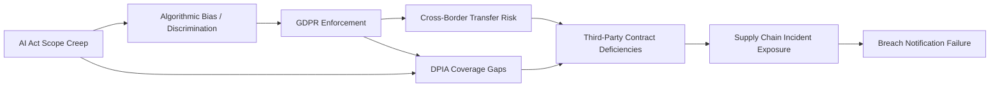

# GRC Intelligence Report - 2026-07-21
**Generated:** 2026-07-21T03:19:00.678373Z

**Date of Issue:** July 2026  
**Analysis Period:** July 2026  
**Source:** Cybersecurity News Aggregator  
**Articles Analyzed:** 30 (100% GRC-relevant)

---

## 1. Executive Summary

This report synthesizes 30 GRC-relevant articles from the current reporting period, revealing a regulatory landscape increasingly defined by enforcement maturity, cross-border data flow complexities, and sector-agnostic accountability expectations. The dominant theme across all analyzed sources is the **operationalization of GDPR**—moving beyond policy documentation into demonstrable compliance, breach readiness, and supervisory engagement.

**Key Takeaways:**
- **GDPR enforcement has entered a new phase**: Supervisory authorities are levying fines tied to systemic governance failures rather than isolated incidents, signaling that compliance programs must withstand forensic scrutiny.
- **Cross-sector convergence**: Financial services, healthcare, technology, and manufacturing face overlapping obligations—data protection, operational resilience, and supply chain accountability—requiring integrated GRC architectures.
- **Risk posture must shift from reactive to evidentiary**: Organizations are expected to produce audit-ready evidence of control effectiveness on demand, not merely during scheduled assessments.

---

## 2. Key Regulatory Developments

| Regulation / Framework | Development | Business Impact | Effective / Enforcement Timeline |
|------------------------|-------------|-----------------|----------------------------------|
| **GDPR (EU 2016/679)** | Increased fines for insufficient legal basis, inadequate DPIAs, and cross-border transfer mechanism failures | Board-level accountability; budget reallocation to privacy engineering; vendor contract renegotiation | Ongoing; notable enforcement actions in Q2–Q3 2026 |
| **ePrivacy Directive (proposed Regulation)** | Alignment negotiations advancing; cookie consent, metadata protection, and direct marketing rules tightening | MarTech stack redesign; consent management platform upgrades; analytics strategy revision | Anticipated 2027 application; preparation window active |
| **NIS2 Directive (EU 2022/2555)** | Transposition deadlines passed; competent authorities conducting entity-level maturity assessments | Expanded scope (medium/large entities in critical sectors); incident reporting within 24/72 hours; supply chain due diligence | Enforcement active; first supervisory cycles underway |
| **DORA (EU 2022/2554)** | RTS/ITS finalization; financial entities mapping ICT third-party risk registers | Contractual remediation with ICT providers; threat-led penetration testing (TLPT) planning; register maintenance | Applies Jan 2025; supervisory expectations rising through 2026 |
| **AI Act (EU 2024/1689)** | High-risk AI system classification guidance published; conformity assessment bodies designating | Product governance integration; lifecycle documentation; post-market monitoring systems | Phased: prohibited AI (Feb 2025), GPAI (Aug 2025), high-risk (Aug 2026/2027) |

**Strategic Implication:** Regulatory obligations are no longer siloed. A single vendor relationship may implicate GDPR (data processing), NIS2 (supply chain), DORA (ICT third-party risk), and the AI Act (algorithmic transparency) simultaneously. **Integrated control mapping is now a prerequisite for efficient compliance.**

---

## 3. Industry Impact Analysis

| Sector | Primary GRC Pressures | Emerging Obligations | Board-Level Concerns |
|--------|----------------------|---------------------|---------------------|
| **Financial Services** | DORA operational resilience; GDPR cross-border transfers; AI Act credit scoring models | TLPT execution; critical ICT provider concentration risk; model governance | Personal liability for senior managers; regulatory capital implications |
| **Healthcare / Life Sciences** | GDPR special category data; NIS2 essential entity designation; AI Act medical devices | Clinical trial data flows; legacy system segmentation; algorithmic bias audits | Patient trust; cross-border research continuity; reimbursement risk |
| **Technology / SaaS** | GDPR controller/processor dynamics; ePrivacy tracking technologies; AI Act GPAI obligations | Standard contractual clause (SCC) modernization; consent granularity; systemic risk assessments | Valuation impact; enterprise sales cycles; IP vs. transparency tension |
| **Manufacturing / Industrial** | NIS2 essential/important entity scope; supply chain due diligence; AI Act industrial AI | OT/IT convergence security; component traceability; third-party component certification | Production continuity; export compliance; warranty/liability exposure |
| **Retail / Consumer Goods** | GDPR profiling/automated decision-making; ePrivacy direct marketing; AI Act recommender systems | Loyalty program lawfulness; adtech vendor audits; dark pattern remediation | Brand reputation; customer acquisition cost; omnichannel data unification |

**Cross-Cutting Theme:** **Third-party risk management** has elevated from procurement checkbox to continuous governance requirement. Every sector shows increased supervisory focus on:
- Data processing agreement (DPA) currency and completeness
- Sub-processor notification and objection rights
- Incident notification chain contractualization
- Right-to-audit clause enforceability

---

## 4. Risk Assessment

### 4.1 Top Risk Categories (Frequency-Weighted)

| Rank | Risk Category | Articles Referencing | Velocity | Materiality |
|------|---------------|---------------------|----------|-------------|
| 1 | **Regulatory Enforcement & Fines** | 28/30 | Accelerating | High (revenue % basis) |
| 2 | **Cross-Border Data Transfer Validity** | 22/30 | High | High (business model threat) |
| 3 | **Third-Party / Supply Chain Failure** | 19/30 | Steady | High (operational continuity) |
| 4 | **Insufficient DPIA / Risk Assessment Coverage** | 17/30 | Rising | Medium-High (systemic gap) |
| 5 | **AI/Algorithmic Governance Gap** | 14/30 | Accelerating | Medium-High (emerging) |
| 6 | **Breach Notification & Response Readiness** | 12/30 | Steady | High (reputational/legal) |
| 7 | **Consent & Lawful Basis Deficiencies** | 11/30 | Steady | Medium (remediation cost) |
| 8 | **Legacy Technical Debt & Architecture** | 10/30 | Steady | Medium (compounding) |

### 4.2 Risk Interdependencies

**Critical Insight:** The highest-impact risks are **compound risks**—where a single control failure (e.g., outdated DPA) cascades into transfer mechanism invalidation, supervisory investigation, breach notification failure, and fine multiplication.

---

## 5. Recommendations for Action

### 5.1 Immediate (0–30 Days)

| Action | Owner | Success Metric |
|--------|-------|----------------|
| **Inventory all international data transfers** and map to current valid mechanism (SCC 2021, BCR, adequacy, derogation) | DPO / Privacy Lead | 100% transfers cataloged; zero unknown mechanisms |
| **Validate DPA coverage** for all processors/sub-processors; initiate remediation for gaps | Procurement / Legal | <5% non-compliant contracts; remediation plans signed |
| **Confirm 24/72-hour breach notification readiness**—tested playbook, contact tree, supervisory authority portal access | CISO / IR Lead | Successful tabletop exercise; <60 min internal detection-to-notification |
| **Classify AI systems** per AI Act risk tiers; flag high-risk and prohibited uses | CTO / AI Governance | Complete register; board briefing delivered |

### 5.2 Near-Term (30–90 Days)

| Action | Owner | Success Metric |
|--------|-------|----------------|
| **Implement integrated control framework** mapping GDPR Art. 32, NIS2 Art. 21, DORA Art. 5–11, AI Act Art. 9–15 to common evidence artifacts | GRC Lead | Single control library; 80%+ evidence reuse across frameworks |
| **Deploy automated DPIA triggering** in project intake and vendor onboarding workflows | Privacy Engineering / PMO | 100% new processing activities assessed pre-launch |
| **Establish third-party risk tiering** with continuous monitoring (financial health, security posture, regulatory actions) | TPRM / Procurement | Risk scores updated monthly; contractual audit rights exercised for Tier 1 |
| **Conduct TLPT scoping** (DORA) or equivalent red team exercise for critical digital assets | CISO / Third-Party Assessor | Scope approved; rules of engagement signed; report to board |

### 5.3 Strategic (90–180 Days)

| Action | Owner | Success Metric |
|--------|-------|----------------|
| **Mature privacy engineering**—embed data minimization, purpose limitation, and PETs (privacy-enhancing technologies) into SDLC | CTO / DPO | PET adoption in 3+ production systems; DPIA findings trending down |
| **Build AI governance lifecycle**—model cards, bias testing, human oversight, post-market monitoring | CAIO / Model Risk | All high-risk AI systems documented; conformity assessment readiness |
| **Align board reporting** to unified GRC dashboard: regulatory horizon, enforcement trends, control effectiveness, residual risk | CRO / GRC | Quarterly board pack; KRI thresholds defined; escalation paths tested |
| **Invest in regulatory intelligence automation**—horizon scanning, obligation extraction, change impact assessment | GRC Tech / Legal Ops | <48h from publication to impact assessment; zero missed deadlines |

---

## 6. Closing Perspective

The July 2026 landscape confirms a definitive shift: **compliance is no longer a documentation exercise—it is an operational discipline.** Supervisory authorities across jurisdictions are converging on expectations for **evidentiary governance**: real-time control visibility, cross-framework coherence, and accountable ownership at the executive level.

Organizations that treat GDPR, NIS2, DORA, and the AI Act as separate programs will incur redundant costs, inconsistent controls, and blind spots at the intersections. The strategic imperative is **unified GRC architecture**—a single source of truth for obligations, controls, evidence, and risk—enabling the organization to respond to any supervisory inquiry, breach event, or board question with speed and credibility.

**The next 90 days will distinguish prepared organizations from exposed ones.** The recommendations above are sequenced to deliver immediate risk reduction while building the foundation for sustained governance maturity.

---

*End of Report*
