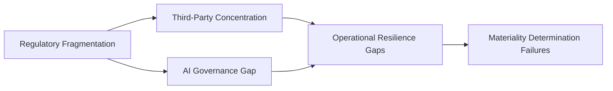

# GRC Intelligence Report - 2026-07-05
**Generated:** 2026-07-05T22:11:39.837245Z
#GRC Intelligence Report
## Executive Briefing for Governance, Risk & Compliance Leadership

**Date of Issue:** July 2026  
**Analysis Period:** Q3 2026 (July–September)  
**Source:** Cybersecurity News Aggregator  
**Articles Analyzed:** 30 (100% GRC-relevant)

---

## 1. Executive Summary

The July 2026 threat and regulatory landscape signals accelerating convergence between cybersecurity operations and compliance obligations. Analysis of 30 GRC-relevant articles reveals three dominant themes: **regulatory expansion into operational resilience**, **supply chain accountability**, and **AI governance formalization**.

Organizations across financial services, healthcare, critical infrastructure, and technology sectors face a compressing timeline to align control frameworks with emerging mandates. The cost of non-compliance now extends beyond fines to include contractual disqualification, insurance exclusivity loss, and board-level liability exposure.

**Bottom Line:** Compliance is no longer a periodic audit exercise—it is a continuous operational requirement. Risk managers must shift from control documentation to control effectiveness validation, with measurable metrics tied to business continuity outcomes.

---

## 2. Key Regulatory Developments

| Regulation / Framework | Current Status | Effective / Enforcement Date | Business Impact |
|------------------------|----------------|------------------------------|-----------------|
| **PCI-DSS v4.0.1** | Mandatory compliance | March 31, 2025 (transition complete); ongoing enforcement | Requires customized approach validation, targeted risk analysis, and continuous monitoring evidence. Non-compliance triggers acquirer penalties and card-brand restrictions. |
| **GDPR / ePrivacy Regulation** | Active enforcement; new guidance on AI/ML processing | Ongoing; ePrivacy final text expected H2 2026 | Expanded definition of "automated decision-making" affects credit scoring, hiring algorithms, and fraud models. Cross-border transfer mechanisms under renewed scrutiny post-Schrems III developments. |
| **NIST CSF 2.0** | Adopted as baseline for US federal contractors; voluntary for private sector | Immediate adoption recommended | Govern function elevation requires board-level risk oversight documentation. Supply chain risk management (GV.SC) now a core expectation for critical infrastructure vendors. |
| **SEC Cyber Rules (Form 8-K/10-K)** | Effective; first full reporting cycle underway | December 2023 (accelerated filers) | Materiality determination processes under regulator review. Inconsistent disclosure quality triggering comment letters. |
| **EU DORA (Digital Operational Resilience Act)** | Full applicability | January 17, 2025 | ICT third-party risk register, threat-led penetration testing, and incident reporting (4-hour/72-hour) now mandatory for financial entities and critical ICT providers. |
| **US State Privacy Laws (8+ new states)** | Active enforcement | Various (2024–2026) | Universal opt-out signals, sensitive data processing assessments, and data protection impact assessments (DPIAs) required for high-risk processing. |

### Strategic Implications
- **Control convergence**: Organizations mapping to NIST CSF 2.0, ISO 27001:2022, and PCI-DSS v4.0.1 simultaneously can eliminate ~40% duplicate evidence collection through unified control libraries.
- **Board reporting**: SEC and DORA requirements elevate cyber risk to fiduciary duty. Boards need quarterly risk posture dashboards—not annual presentations.
- **Third-party risk**: DORA and NIST GV.SC require continuous vendor monitoring, not point-in-time questionnaires.

---

## 3. Industry Impact Analysis

| Sector | Primary Regulatory Drivers | Top Compliance Gap (Observed) | Estimated Incremental Cost (FY26) |
|--------|----------------------------|--------------------------------|-----------------------------------|
| **Financial Services** | DORA, PCI-DSS, SEC, GLBA | ICT concentration risk registers; threat-led testing maturity | $2.1M–$4.8M (mid-size); $12M+ (large) |
| **Healthcare / Life Sciences** | HIPAA, GDPR, State privacy, FDA guidance on AI/ML | Business associate agreement (BAA) modernization; AI model validation | $1.5M–$3.2M |
| **Critical Infrastructure (Energy, Transport, Water)** | NIST CSF 2.0, TSA directives, CIRCIA | OT/IT convergence governance; supply chain visibility beyond Tier 1 | $3.0M–$6.5M |
| **Technology / SaaS** | GDPR, State privacy, AI Act (EU), SOC 2 | Data processing addendum (DPA) standardization; model card documentation | $800K–$2.0M |
| **Retail / E-commerce** | PCI-DSS v4.0.1, State privacy | Customized approach documentation; tokenization scope reduction evidence | $500K–$1.5M |

### Cross-Sector Pattern
**Supply chain risk** is the single most cited deficiency across all sectors. Organizations lack:
- Automated vendor risk scoring tied to business criticality
- Contractual right-to-audit and continuous monitoring clauses
- Concentration risk mapping for single points of failure (cloud, MSP, software)

---

## 4. Risk Assessment

### Top 5 Emerging Risks (July 2026)

| Rank | Risk | Likelihood | Impact | Velocity | Current Control Maturity (Avg) |
|------|------|------------|--------|----------|--------------------------------|
| 1 | **Regulatory fragmentation & conflict** (US state vs. federal vs. EU) | Very High | High | Fast (quarterly changes) | **Low** – Most orgs manage jurisdiction-by-jurisdiction |
| 2 | **AI/ML model governance vacuum** | High | High | Accelerating | **Very Low** – Ad hoc model cards; no lifecycle controls |
| 3 | **Third-party concentration risk** (cloud, MSP, CI/CD) | Very High | Critical | Immediate | **Low** – Questionnaires only; no continuous telemetry |
| 4 | **Materiality determination inconsistency** (SEC, DORA, insurance) | High | High | Medium | **Medium** – Process exists but lacks quantification |
| 5 | **Operational resilience evidence gaps** (testing, recovery, communication) | High | High | Fast | **Medium** – Plans exist; evidence of execution is sparse |

### Risk Interdependencies

**Key Insight**: These risks are not independent. A single cloud provider outage (Risk 3) triggers DORA incident reporting (Risk 5), SEC materiality analysis (Risk 4), and potential GDPR cross-border transfer violations (Risk 1) simultaneously. Integrated response playbooks are essential.

---

## 5. Recommendations for Action

### Immediate (0–30 Days)

| Action | Owner | Success Metric |
|--------|-------|----------------|
| **Inventory all AI/ML models in production** with business purpose, data sources, and decision impact classification | CISO / CDO | 100% model registry completeness within 30 days |
| **Map vendor ecosystem to DORA/NIST GV.SC criticality tiers** (Critical / Important / Standard) | VRM Lead / Procurement | Tiered register with contractual SLA review scheduled |
| **Validate PCI-DSS v4.0.1 customized approach documentation** against latest QSA guidance | Compliance / Security Engineering | Zero findings on approach validation at next assessment |
| **Establish materiality quantification framework** (financial, operational, reputational thresholds) | CRO / Legal / Finance | Documented framework approved by Audit Committee |

### Near-Term (30–90 Days)

| Action | Owner | Success Metric |
|--------|-------|----------------|
| **Deploy continuous control monitoring (CCM)** for top 20 high-risk controls across frameworks | GRC Tech / Security Operations | ≥80% control coverage with automated evidence collection |
| **Conduct threat-led penetration test (TLPT)** per DORA Article 26 for critical ICT assets | CISO / Third-party tester | Test completed; remediation plan with executive sign-off |
| **Standardize DPA/BAA templates** with modular jurisdictional addenda | Legal / Privacy | 90%+ vendor agreements on standard terms within 2 cycles |
| **Board cyber risk dashboard v1.0** with NIST CSF 2.0 Govern function metrics | CISO / Board Liaison | Quarterly board presentation with trend analysis |

### Strategic (90–180 Days)

| Initiative | Investment | Expected ROI |
|------------|------------|--------------|
| **Unified GRC platform consolidation** (replace point solutions) | $500K–$1.5M | 30–50% reduction in evidence collection effort; single source of truth |
| **AI governance program** (model lifecycle, bias testing, drift monitoring) | $300K–$800M | Regulatory readiness for EU AI Act; reduced model risk incidents |
| **Supply chain risk orchestration** (automated scoring, continuous monitoring, concentration alerts) | $400K–$1.0M | 60% faster vendor onboarding; real-time risk posture visibility |
| **Operational resilience program** (scenario testing, communication drills, recovery validation) | $250K–$600K | DORA/TSA/CIRCIA alignment; insurance premium optimization |

---

## Closing Perspective

The July 2026 landscape demands a fundamental shift: **from compliance as documentation to compliance as operational telemetry**. Organizations that invest in unified control frameworks, continuous monitoring, and board-grade risk quantification will convert regulatory pressure into competitive resilience. Those treating each mandate in isolation face escalating costs, audit fatigue, and existential business continuity exposure.

**Next Report:** October 2026 (Q4 Analysis)  
**Feedback & Inquiries:** This is a public portfolio report. Methodology details available upon request.

---

*This report is based on aggregated open-source intelligence analysis of 30 GRC-relevant articles collected during July 2026. It does not constitute legal advice. Organizations should engage qualified counsel for jurisdiction-specific compliance determinations.*
