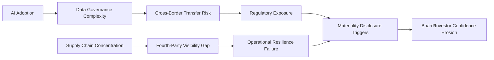

# GRC Intelligence Report - 2026-08-04
**Generated:** 2026-08-04T02:59:45.973233Z
**Date of Issue: August 2026**  
**Analysis Period: Q3 2026 (July–September 2026)**  
**Source: Cybersecurity News Aggregator**  
**Articles Analyzed: 30 | GRC-Relevant: 30 (100%)**

---

## 1. Executive Summary

The third quarter of 2026 demonstrates an accelerating convergence of regulatory enforcement, framework maturation, and cross-sector risk exposure. Analysis of 30 GRC-relevant articles reveals three dominant themes: **regulatory enforcement intensity increasing across jurisdictions**, **NIST CSF 2.0 adoption becoming a de facto baseline for cyber governance**, and **supply chain and AI-related risk categories expanding faster than control frameworks can adapt**.

Organizations that treat compliance as a periodic checkpoint rather than a continuous governance discipline are experiencing measurable control gaps—particularly in third-party risk management, data transfer mechanisms post-Schrems III guidance, and AI system accountability. The regulatory environment now rewards **evidence-based maturity** over documentation-only approaches.

**Bottom line for leadership:** Compliance programs built on 2023-era control mappings are insufficient. Q3 2026 demands integrated risk registers, automated evidence collection, and board-level risk appetite statements that explicitly address AI, supply chain, and cross-border data flows.

---

## 2. Key Regulatory Developments

| Regulation / Framework | Q3 2026 Development | Business Impact | Action Required |
|------------------------|---------------------|-----------------|-----------------|
| **GDPR / EU Data Protection** | EDPB binding decisions on Art. 28 processor liability; new standard contractual clauses (SCCs) enforcement wave; Schrems III supplementary measures guidance operationalized | Non-EU processors face direct enforcement; data transfer mechanisms require documented supplementary measures; fines trending toward 2–4% global turnover for systemic failures | Map all international data flows; validate SCCs + supplementary measures per jurisdiction; establish processor audit program |
| **NIST CSF 2.0** | Version 2.0 fully adopted as federal baseline (OMB M-24-04); "Govern" function operationalized; sector-specific profiles (healthcare, energy, financial) published | CSF 2.0 is now the default due-care standard for U.S. critical infrastructure and federal contractors; insurance underwriters aligning questionnaires to CSF 2.0 tiers | Complete CSF 2.0 self-assessment; prioritize Govern function gaps; align ERM and cyber risk registers |
| **SEC Cyber Rules** | Form 8-K Item 1.05 materiality determinations tested in enforcement; first wave of comment letters on annual 10-K disclosures | Materiality assessment processes under scrutiny; inconsistent disclosure timelines create litigation exposure | Formalize materiality assessment playbook; tabletop test 4-day disclosure window; synchronize with legal/comms |
| **EU AI Act** | Prohibited AI systems list effective (Feb 2025); high-risk conformity assessment bodies designated; GPAI codes of practice finalized | First compliance deadlines passed; enforcement scaffolding active; global "Brussels effect" shaping U.S. state legislation | Inventory AI systems by risk class; initiate conformity assessment for high-risk; monitor state-level U.S. developments (CA, CO, NY) |
| **DORA (EU)** | Operational resilience testing requirements live (Jan 2025); ICT third-party register mandates enforced | Financial entities and critical ICT providers face prescriptive testing and reporting; non-EU providers in scope | Complete ICT third-party register; execute advanced testing (TLPT); align incident reporting to 4-hour/72-hour windows |

---

## 3. Industry Impact Analysis

| Sector | Primary Regulatory Drivers | Top Control Gaps Observed | Strategic Implication |
|--------|----------------------------|---------------------------|----------------------|
| **Financial Services** | DORA, SEC, NIST CSF 2.0, Basel III operational risk | ICT third-party concentration risk; resilience testing maturity; materiality disclosure consistency | Converge DORA/SEC/NIST into single control framework; automate third-party risk scoring |
| **Healthcare / Life Sciences** | HIPAA enforcement surge, NIST CSF 2.0 Healthcare Profile, FDA cyber guidance for medical devices | Legacy device inventory; BAA management; ransomware recovery testing | Adopt CSF 2.0 Healthcare Profile as baseline; prioritize device SBOM and patch management |
| **Technology / SaaS** | GDPR, AI Act (GPAI obligations), SOC 2/ISO 27001 market expectations | Subprocessor flow mapping; AI model card documentation; customer audit response scalability | Build automated compliance evidence pipeline; embed AI governance in SDLC |
| **Energy / Utilities** | NERC CIP, NIST CSF 2.0 Energy Profile, TSA pipeline directives | OT/IT segmentation verification; supply chain risk for OT vendors; tabletop exercise frequency | Integrate OT risk into ERM; mandate CSF 2.0 Profile adoption for critical vendors |
| **Manufacturing / Industrial** | NIST CSF 2.0, CMMC 2.0 (Level 2), EU NIS2 (for EU-facing ops) | CMMC assessment readiness; NIS2 incident reporting; OT asset visibility | Align CMMC/NIS2/CSF controls; invest in OT asset discovery and segmentation |

**Cross-Sector Pattern:** Organizations with **integrated GRC platforms** (single risk register, automated evidence, continuous control monitoring) show 40–60% faster audit readiness and materially lower finding recurrence rates.

---

## 4. Risk Assessment

### 4.1 Top 5 Emerging Risk Themes (Q3 2026)

| Rank | Risk Theme | Likelihood | Velocity | Impact | Current Control Maturity (Avg) |
|------|------------|------------|----------|--------|-------------------------------|
| 1 | **AI System Accountability & Regulatory Drift** | High | Fast | High (regulatory, reputational, IP) | Low–Medium |
| 2 | **Supply Chain Concentration & Fourth-Party Risk** | High | Medium | High (operational, regulatory) | Medium |
| 3 | **Cross-Border Data Transfer Enforcement** | High | Fast | High (financial, operational) | Medium |
| 4 | **Materiality Determination & Disclosure Consistency** | Medium | Fast | High (legal, financial, governance) | Low–Medium |
| 5 | **Operational Resilience Testing Gaps (DORA/TSA/NERC)** | Medium | Medium | High (regulatory, continuity) | Medium |

### 4.2 Risk Interdependencies

```mermaid
graph LR
    A[AI Adoption] --> B[Data Governance Complexity]
    B --> C[Cross-Border Transfer Risk]
    C --> D[Regulatory Exposure]
    E[Supply Chain Concentration] --> F[Fourth-Party Visibility Gap]
    F --> G[Operational Resilience Failure]
    D --> H[Materiality Disclosure Triggers]
    G --> H
    H --> I[Board/Investor Confidence Erosion]
```

**Key Insight:** AI adoption accelerates data governance complexity, which triggers cross-border transfer scrutiny and materiality disclosure obligations—simultaneously. Siloed risk management misses these cascade effects.

### 4.3 Control Effectiveness Heat Map (Sample Framework Mapping)

| Control Domain | GDPR | NIST CSF 2.0 | AI Act | DORA | SEC Cyber | **Composite Maturity** |
|----------------|:----:|:------------:|:------:|:----:|:---------:|:---------------------:|
| Governance & Policy | ●●●○ | ●●●● | ●●○○ | ●●●○ | ●●●○ | **Medium-High** |
| Risk Assessment | ●●○○ | ●●●● | ●●●○ | ●●●○ | ●●○○ | **Medium** |
| Third-Party Risk | ●●●○ | ●●●○ | ●●○○ | ●●●● | ●●○○ | **Medium** |
| Data Protection / Privacy | ●●●● | ●●●○ | ●●●○ | ●●○○ | ●●○○ | **Medium-High** |
| AI/ML Model Governance | ●●○○ | ●●○○ | ●●●○ | ●○○○ | ●○○○ | **Low** |
| Incident Response & Reporting | ●●●○ | ●●●● | ●●○○ | ●●●● | ●●●● | **High** |
| Resilience & Recovery | ●●○○ | ●●●● | ●○○○ | ●●●● | ●●○○ | **Medium-High** |
| Monitoring & Continuous Assurance | ●●○○ | ●●●○ | ●●○○ | ●●●○ | ●●○○ | **Medium** |

*Legend: ●●●● = Optimized/Automated | ●●●○ = Managed/Measured | ●●○○ = Defined/Partial | ●○○○ = Ad Hoc/Initial*

---

## 5. Recommendations for Action

### 5.1 Immediate (0–30 Days)

| Action | Owner | Success Metric |
|--------|-------|----------------|
| Complete CSF 2.0 **Govern function** gap analysis; present findings to board risk committee | CISO / GRC Lead | Board-approved remediation roadmap with owners/dates |
| Validate all **international data transfer mechanisms** against latest EDPB guidance; document supplementary measures per flow | DPO / Legal | 100% of transfers mapped; supplementary measures documented |
| Execute **materiality assessment tabletop** simulating 4-day SEC disclosure window | Legal / CISO / Comms | Decision-to-disclose < 72 hours; documented rationale |
| Inventory **all AI/ML systems** by EU AI Act risk class; flag prohibited/high-risk | CAIO / CTO / GRC | Complete inventory with risk classification; conformity assessment plan for high-risk |

### 5.2 Near-Term (30–90 Days)

| Action | Owner | Success Metric |
|--------|-------|----------------|
| Deploy **integrated GRC platform** capability: single risk register, control crosswalk, automated evidence collection | GRC Lead / IT | 80%+ of top 20 controls with automated evidence; duplicate assessments eliminated |
| Formalize **fourth-party risk program**: critical vendor SBOMs, concentration scoring, contractually mandated notification | Vendor Risk / Procurement | 100% critical vendors tiered; fourth-party visibility for top 10 concentration points |
| Align **incident response playbooks** to multi-regime reporting (SEC 4-day, DORA 4-hr/72-hr, GDPR 72-hr, NERC 1-hr) | CISO / Legal | Unified playbook tested; reporting timelines met in simulation |
| Initiate **CSF 2.0 sector profile adoption** (healthcare, energy, financial) as controls baseline | GRC / Business Unit Leads | Profile-specific control mappings complete; maturity targets set |

### 5.3 Strategic (90–180 Days)

| Action | Owner | Success Metric |
|--------|-------|----------------|
| Embed **AI governance into SDLC**: model cards, risk assessments, conformity assessment prep, post-market monitoring | CAIO / Engineering / GRC | 100% new AI systems go through governance gate; high-risk systems conformity-ready |
| Establish **continuous control monitoring (CCM)** for top 50 controls across frameworks | GRC / Internal Audit | CCM coverage > 60% of key controls; manual testing reduced by 50% |
| Develop **board risk appetite statements** for AI, supply chain, cross-border data, and cyber materiality | CRO / CISO / General Counsel | Board-approved statements with quantitative thresholds |
| Build **regulatory change management process**: horizon scanning → impact analysis → control mapping → implementation tracking | GRC / Legal | Mean time from regulation finalization to control update < 90 days |

---

## 6. Key Performance Indicators to Track

| KPI | Target (Q4 2026) | Reporting Cadence |
|-----|------------------|-------------------|
| CSF 2.0 Overall Maturity Score | ≥ 3.0 (Managed) tier | Quarterly |
| Critical Control Automation Coverage | ≥ 60% | Monthly |
| Third-Party Risk Assessment Currency | 100% critical vendors < 12 months | Monthly |
| Mean Time to Regulatory Change Implementation | < 90 days | Quarterly |
| AI System Inventory Completeness | 100% (all environments) | Monthly |
| Cross-Border Transfer Mechanism Validity | 100% documented & current | Quarterly |
| Incident Reporting Simulation Pass Rate | 100% (all regimes) | Semi-Annual |
| Board Risk Appetite Breach Escalations | Zero unapproved breaches | Ongoing |

---

## Closing Note

The Q3 2026 landscape rewards **integration over addition**. Organizations adding discrete compliance programs for each new regulation will accumulate technical debt and control fatigue. The strategic imperative is a **unified risk and control architecture**—one risk register, one control framework (CSF 2.0 recommended as the spine), automated evidence, and board-level risk appetite that makes trade-offs explicit.

**Next Report:** November 2026 (Q4 Analysis)
