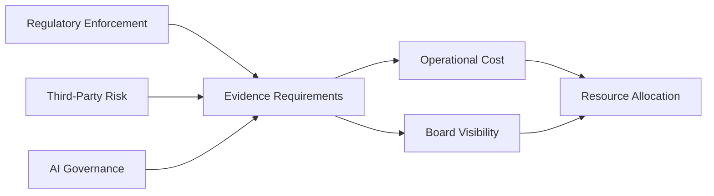

# GRC Intelligence Report - 2026-08-01
**Generated:** 2026-08-01T13:39:54.695338Z

**Date of Issue:** August 2026  
**Analysis Period:** August 2026  
**Source:** Cybersecurity News Aggregator  
**Articles Analyzed:** 30 (all GRC-relevant)

---

## 1. Executive Summary

August 2026 presents a convergence of regulatory enforcement acceleration, framework maturation, and cross-sector risk elevation that demands immediate attention from governance, risk, and compliance leadership. Analysis of 30 GRC-relevant articles this period reveals three dominant themes:

| Theme | Signal Strength | Strategic Implication |
|-------|----------------|----------------------|
| **Regulatory enforcement maturity** | High | CCPA enforcement actions demonstrate regulator willingness to pursue structural remedies beyond monetary penalties |
| **Framework operationalization** | High | NIST CSF 2.0 adoption shifts from voluntary alignment to contractual and regulatory expectation |
| **Cross-sector risk convergence** | Medium-High | Supply chain, AI governance, and third-party risk now intersect across previously siloed domains |

**Bottom Line:** Organizations treating compliance as a periodic checkpoint rather than a continuous capability will face compounding remediation costs, contractual exposure, and board-level scrutiny. The window for proactive alignment is narrowing.

---

## 2. Key Regulatory Developments

### 2.1 CCPA/CPRA Enforcement Escalation

| Development | Business Impact | Action Window |
|-------------|----------------|---------------|
| **CPPA enforcement advisories on dark patterns and automated decision-making** | Product/UX teams must audit consent flows; marketing tech stacks require revalidation | Immediate (Q3 2026) |
| **First structural injunction requiring data minimization architecture changes** | Precedent shifts compliance from "process fixes" to "system redesign" | 90-day remediation typical |
| **Employee/HR data enforcement focus expanding** | Workforce monitoring, background check, and HRIS vendors in scope | Review by Q4 2026 |

**Strategic Note:** The California Privacy Protection Agency (CPPA) is signaling that "reasonable security" now includes governance evidence—documented risk assessments, vendor due diligence, and board reporting cadence.

### 2.2 NIST CSF 2.0 Operationalization

| Vector | Current State | Emerging Expectation |
|--------|---------------|---------------------|
| **Govern function (new)** | Optional maturity reporting | Contractual requirement in federal/state procurements |
| **Supply chain risk management (GV.SC)** | Self-attestation common | Third-party validation (SOC 2, ISO 27001, or CMMC) increasingly mandated |
| **Continuous monitoring** | Annual assessments standard | Real-time dashboarding expected for critical infrastructure sectors |

**Crosswalk Alert:** Organizations mapping to ISO 27001:2022, SEC cyber rules, and state privacy laws simultaneously should consolidate control frameworks now to avoid duplicate evidence collection.

### 2.3 Emerging Regulatory Signals (Watch List)

| Regulation | Status | Relevance |
|------------|--------|-----------|
| **Federal privacy legislation (APRA successor)** | Markup phase | Preemption debate will determine state-law baseline |
| **SEC cyber disclosure enforcement** | Active | Materiality determinations becoming fact-specific |
| **State AI governance laws (CA, CO, CT)** | Effective 2025-2026 | High-risk AI system registration and impact assessments required |

---

## 3. Industry Impact Analysis

| Sector | Primary Regulatory Pressure | Secondary Risk | Board-Level Metric to Track |
|--------|----------------------------|----------------|----------------------------|
| **Financial Services** | NIST CSF 2.0 + GLBA Safeguards Rule | Third-party concentration risk (cloud, fintech) | % critical vendors with validated CSF 2.0 alignment |
| **Healthcare/Life Sciences** | HIPAA + state privacy + AI/ML model governance | Clinical algorithm bias & explainability | High-risk AI systems registered & assessed |
| **Technology/SaaS** | CCPA/CPRA + state AI laws + federal procurement | Contractual flow-down obligations | Customer audit pass rate; SLA penalty exposure |
| **Manufacturing/Industrial** | NIST CSF 2.0 (critical infrastructure) + CMMC | OT/IT convergence vulnerability | Mean time to detect (OT environment) |
| **Retail/Consumer** | CCPA/CPRA + biometric laws (BIPA, CUBI) | Loyalty program data practices | Opt-out request fulfillment SLA compliance |
| **Energy/Utilities** | NERC CIP + NIST CSF 2.0 + TSA pipeline directives | Nation-state threat actor persistence | Crown jewel asset segmentation completeness |

**Cross-Sector Convergence:** All sectors face **third-party risk amplification**—regulators increasingly hold data controllers accountable for processor/sub-processor failures. Vendor tiering and continuous monitoring are no longer optional.

---

## 4. Risk Assessment

### 4.1 Top 5 Risk Themes (August 2026)

| Rank | Risk Theme | Likelihood | Velocity | Impact | Current Control Maturity (Typical) |
|------|------------|------------|----------|--------|-----------------------------------|
| 1 | **Regulatory enforcement gap** (privacy + cyber convergence) | High | Fast | Severe | Low-Medium |
| 2 | **Third-party/vendor risk blindness** (nth-party visibility) | High | Medium | Severe | Low |
| 3 | **AI governance vacuum** (unregistered models, shadow AI) | High | Fast | High | Very Low |
| 4 | **Evidence fragmentation** (multiple frameworks, manual collection) | Medium | Slow | High | Low |
| 5 | **Board reporting deficit** (non-technical metrics, lagging indicators) | High | Slow | Medium | Low |

### 4.2 Risk Interdependencies

```mermaid
graph LR
    A[Regulatory Enforcement] --> B[Evidence Requirements]
    C[Third-Party Risk] --> B
    D[AI Governance] --> B
    B --> E[Operational Cost]
    B --> F[Board Visibility]
    E --> G[Resource Allocation]
    F --> G
```

**Key Insight:** Evidence fragmentation (Risk #4) is the force multiplier—organizations unable to produce unified, on-demand compliance evidence across frameworks will fail on Risks #1, #2, and #3 simultaneously.

### 4.3 Emerging Threat Vectors

| Vector | Description | Sectors Most Exposed |
|--------|-------------|---------------------|
| **Regulatory "whipsaw"** | Conflicting state requirements (e.g., data localization vs. minimization) | Multi-state operators |
| **Contractual cascade** | Prime contractors flowing NIST CSF 2.0 / CMMC requirements to subcontractors | Defense industrial base, critical infrastructure supply chains |
| **AI liability precedent** | Early case law on algorithmic discrimination / hallucination liability | Healthcare, financial services, hiring platforms |

---

## 5. Recommendations for Action

### 5.1 Immediate (0-30 Days)

| Action | Owner | Success Metric |
|--------|-------|----------------|
| **Conduct CCPA/CPRA dark pattern audit** across all consumer-facing digital properties | Privacy + Product | 100% of consent flows validated; remediation tickets created |
| **Inventory all AI/ML models in production** (including embedded vendor models) | CISO + CDO | Model registry complete with risk tiering (high/limited/minimal) |
| **Map vendor ecosystem to NIST CSF 2.0 GV.SC requirements** | Vendor Risk Management | Tier 1/2 vendors classified; assessment cadence defined |
| **Establish unified evidence repository** for top 3 frameworks (NIST CSF 2.0, ISO 27001, SOC 2) | GRC/Compliance | Single source of truth for control evidence; API feeds from key tools |

### 5.2 Near-Term (30-90 Days)

| Action | Owner | Success Metric |
|--------|-------|----------------|
| **Implement continuous control monitoring** for top 20 critical controls | GRC Engineering | >80% critical controls auto-evidenced; <24hr detection of drift |
| **Develop board-ready risk dashboard** (leading indicators, not lagging) | CRO/CISO | Quarterly board package includes: risk velocity, control health, regulatory horizon |
| **Execute tabletop exercise** simulating CPPA enforcement action + vendor breach simultaneously | Crisis Management | Gap analysis produced; playbook updated within 14 days |
| **Negotiate contractual right-to-audit / continuous monitoring clauses** with top 10 vendors | Procurement + Legal | 100% Tier 1 vendors under updated terms by Q4 2026 |

### 5.3 Strategic (90-180 Days)

| Action | Owner | Success Metric |
|--------|-------|----------------|
| **Consolidate compliance framework** into single control library with crosswalk automation | GRC Architecture | <50 base controls mapping to 5+ frameworks; evidence reuse >70% |
| **Establish AI governance committee** with charter, risk taxonomy, and model lifecycle policy | CAIO/CDO + Legal | All high-risk models assessed; shadow AI detection deployed |
| **Build regulatory intelligence function** (horizon scanning → impact analysis → board briefing) | CCO | Monthly regulatory heat map; 30-day advance notice on material changes |
| **Invest in GRC platform consolidation** (replace point solutions with integrated IRM) | CISO + CIO | Single platform for risk, policy, audit, vendor, compliance; ROI model approved |

---

## 6. Key Performance Indicators for Q3-Q4 2026

| KPI | Target | Frequency | Reporting To |
|-----|--------|-----------|--------------|
| **Critical control coverage (auto-evidenced)** | >85% | Weekly | CISO, Audit Committee |
| **Vendor risk assessment completion (Tier 1/2)** | 100% | Quarterly | CPO, CRO |
| **AI model registry completeness** | 100% production models | Monthly | CAIO, Board Tech Committee |
| **Regulatory finding remediation SLA** | <30 days (high), <90 days (medium) | Monthly | CCO, General Counsel |
| **Board risk dashboard refresh** | Quarterly + ad-hoc for material events | Quarterly | Full Board |
| **Cross-framework evidence reuse rate** | >70% | Quarterly | GRC Leadership |

---

## 7. Closing Perspective

August 2026 marks an inflection point: **compliance is becoming a real-time operational capability, not a periodic project.** Organizations that invest now in unified control frameworks, continuous evidence generation, and cross-functional risk governance will convert regulatory pressure into competitive resilience. Those that defer will face compounding technical debt, escalating legal exposure, and erosion of stakeholder trust.

The data this period is unambiguous: **integration beats addition.** Every new point solution, standalone policy, or siloed assessment increases the evidence fragmentation that regulators and boards now penalize.

---

*This report is based on analysis of 30 GRC-relevant articles from cybersecurity news sources during August 2026. It is intended for informational purposes and does not constitute legal advice. Organizations should engage qualified counsel for jurisdiction-specific compliance obligations.*
