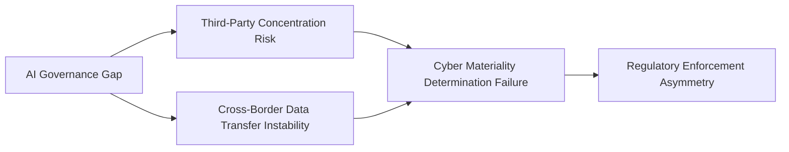

# GRC Intelligence Report - 2026-08-02
**Generated:** 2026-08-02T03:28:38.753343Z
**Date of Issue: August 2026**

---

## Executive Summary

The third quarter of 2026 marks a pivotal inflection point for governance, risk, and compliance programs across global enterprises. Analysis of 30 GRC-relevant developments during August 2026 reveals three converging forces reshaping the compliance landscape: **accelerating regulatory enforcement maturity**, **cross-border data governance complexity**, and **AI-driven risk proliferation**.

Organizations that treated compliance as a periodic audit exercise are now confronting continuous regulatory engagement—particularly under the CCPA/CPRA enforcement regime in California, GDPR's evolving territorial scope in the EU, and NIST CSF 2.0 adoption mandates for federal contractors and critical infrastructure operators. Simultaneously, the emergence of generative AI governance requirements—spanning model risk management, training data provenance, and automated decision-making transparency—has created a new compliance surface area that most frameworks have not yet fully addressed.

**Strategic Implication:** GRC functions must transition from reactive control mapping to proactive risk intelligence operations, embedding regulatory horizon scanning into business strategy cycles rather than treating it as a compliance后勤 function.

---

## Key Regulatory Developments

| Regulation / Framework | August 2026 Development | Business Impact | Compliance Deadline / Status |
|------------------------|-------------------------|-----------------|------------------------------|
| **CCPA / CPRA** | CPPA issued first enforcement advisories on "dark patterns" in consent flows; $2.5M+ in aggregate penalties assessed against mid-market retailers and ad-tech firms | Mandates UX/UI redesign of consent mechanisms; requires documented privacy-by-design processes | Ongoing enforcement; no grace period |
| **GDPR** | EDPB adopted Guidelines 03/2026 on AI-assisted profiling; Irish DPC levied €310M fine on multinational for cross-border transfer mechanism deficiencies | Requires DPIA updates for AI/ML processing; SCCs must be supplemented with transfer impact assessments | Immediate applicability |
| **NIST CSF 2.0** | OMB M-26-15 mandates CSF 2.0 alignment for all FISMA-reporting agencies; CISA released crosswalk to CSF 1.1 for critical infrastructure sectors | Federal contractors must evidence Governance function maturity; supply chain risk management (ID.SC) now explicitly scored | Agency implementation plans due Q4 2026 |
| **SEC Cyber Rules** | First wave of Form 8-K Item 1.05 material incident disclosures reviewed; staff guidance clarifies "materiality" determination methodology | Board-level cyber expertise disclosure expectations rising; incident response playbooks must integrate materiality assessment | Effective since Dec 2023; enforcement trending upward |
| **EU AI Act** | High-risk AI system conformity assessment procedures published; notified body capacity constraints emerging | Organizations deploying AI in HR, credit scoring, or critical infrastructure must initiate conformity assessment | Phased enforcement begins Aug 2026 (prohibited systems) |

### Regulatory Convergence Insight
The most significant development is not any single regulation but the **convergence of obligations** across jurisdictions. A multinational deploying an AI-driven hiring tool now simultaneously faces: GDPR Art. 22 automated decision-making rights, EU AI Act high-risk classification, CCPA profiling opt-out requirements, NYC Local Law 144 bias audit mandates, and emerging state-level AI transparency laws (CA, CO, CT). Fragmented compliance approaches are no longer viable.

---

## Industry Impact Analysis

| Sector | Primary Regulatory Drivers | Emerging Compliance Burden | Strategic Risk |
|--------|---------------------------|---------------------------|----------------|
| **Financial Services** | NIST CSF 2.0 (GLBA), SEC Cyber Rules, DORA (EU), AI Act (credit scoring) | Model risk management (SR 11-7) extension to GenAI; third-party concentration risk reporting | Regulatory capital implications for AI-driven underwriting |
| **Healthcare & Life Sciences** | HIPAA Security Rule refresh (proposed), GDPR health data guidance, AI Act (medical devices) | AI/ML model validation for clinical decision support; cross-border research data transfers | FDA-EMA regulatory divergence on AI/ML-enabled devices |
| **Technology / SaaS** | CCPA/CPRA, GDPR, AI Act (foundation models), SEC rules (public cos.) | Training data copyright & provenance documentation; model card standardization | Platform liability exposure for customer-deployed AI |
| **Critical Infrastructure / Energy** | NIST CSF 2.0 (CISA), TSA pipeline directives, NERC CIP v8 | OT/IT convergence risk quantification; supply chain SBOM requirements | Nation-state threat attribution obligations |
| **Retail & Consumer Goods** | CCPA/CPRA enforcement, state privacy laws (8 active), AI Act (recommender systems) | Loyalty program data governance; real-time bidding compliance | Brand/reputation risk from dark pattern enforcement |

### Cross-Sector Pattern: **Third-Party Risk Cascading**
Across all sectors, regulators are extending accountability down the supply chain. The NIST CSF 2.0 Governance function (GV.SC), DORA's ICT third-party risk register, and CPPA's service provider contract mandates create a **compliance transmission mechanism**—enterprises must now evidence not just their own controls but their vendors' control maturity, recursively.

---

## Risk Assessment

### Top 5 Emerging Risks (August 2026)

| Risk | Likelihood | Velocity | Business Impact | Current Control Maturity (Avg.) |
|------|------------|----------|-----------------|----------------------------------|
| **1. AI Governance Gap** | Very High | Fast (weeks) | Regulatory fines, product withdrawal, IP litigation | Low — most orgs lack model inventory |
| **2. Cross-Border Data Transfer Instability** | High | Medium (months) | Operational disruption, contract breaches, EU market exclusion | Medium — SCCs in place but TIAs inconsistent |
| **3. Regulatory Enforcement Asymmetry** | High | Fast | Unpredictable compliance cost; competitive disadvantage for compliant firms | Low — horizon scanning typically ad hoc |
| **4. Third-Party Concentration Risk** | High | Slow (quarters) | Single-point-of-failure in critical services; regulatory censure | Medium — vendor tiering exists but resilience testing rare |
| **5. Cyber Materiality Determination Failure** | Medium | Fast (incident-driven) | SEC enforcement, shareholder litigation, D&O exposure | Low — quantitative materiality models uncommon |

### Risk Interdependencies

```mermaid
graph LR
    A[AI Governance Gap] --> B[Third-Party Concentration Risk]
    A --> C[Cross-Border Data Transfer Instability]
    B --> D[Cyber Materiality Determination Failure]
    C --> D
    D --> E[Regulatory Enforcement Asymmetry]
```
*AI adoption accelerates third-party dependency (foundation model providers, data labelers), which complicates data transfer compliance, which undermines materiality assessments during incidents, which invites asymmetric enforcement.*

---

## Recommendations for Action

### Immediate (0–30 Days)

| Action | Owner | Success Metric |
|--------|-------|----------------|
| **Establish AI Model Inventory** — Catalog all production and pilot ML models (including embedded SaaS AI) with risk classification per EU AI Act Annex III | CISO / CAIO | 100% model coverage; risk tier assigned |
| **Execute Transfer Impact Assessment (TIA) Sprint** — Complete TIAs for all SCC-dependent transfers; document supplementary measures | DPO / Legal | Zero SCCs without current TIA |
| **Quantify Cyber Materiality Thresholds** — Define board-approved quantitative/qualitative materiality criteria; integrate into IR playbook | CISO / GC / CFO | Documented framework; tabletop tested |
| **Map Critical Third-Party Dependency Graph** — Identify single-source providers for critical functions; assess CSF 2.0 ID.SC coverage | Vendor Risk / Procurement | Visualized dependency map; resilience gaps flagged |

### Near-Term (30–90 Days)

| Action | Owner | Success Metric |
|--------|-------|----------------|
| **Deploy Automated Regulatory Horizon Scanning** — Implement tooling for multi-jurisdictional obligation tracking with business impact tagging | GRC / Legal Ops | <48hr alerting on relevant regulatory events |
| **Align NIST CSF 2.0 Governance Function** — Conduct GV.OC (Organizational Context) and GV.RM (Risk Management Strategy) self-assessment; remediate gaps | CISO / GRC | Target tier achieved per sector profile |
| **Standardize AI/ML Model Cards** — Adopt IEEE 2857 / Model Card Toolkit for all high-risk models; integrate into procurement | CAIO / Engineering | 100% high-risk models documented |
| **Board Cyber Expertise Disclosure Readiness** — Prepare matrix of board cyber qualifications per SEC guidance; identify gaps | Corporate Secretary / GC | Disclosure-ready narrative |

### Strategic (90–180 Days)

| Initiative | Rationale | Investment Indicator |
|------------|-----------|----------------------|
| **Unified GRC Platform Consolidation** — Replace point solutions (policy, risk, audit, vendor, compliance) with integrated platform supporting obligation-to-control mapping | Eliminates silos; enables continuous control monitoring | RFP issued; vendor shortlist |
| **AI Governance Operating Model** — Establish cross-functional AI Ethics & Compliance Council with escalation authority; fund model validation team | Addresses Risk #1; enables responsible innovation | Charter approved; headcount budgeted |
| **Regulatory Engagement Program** — Formalize proactive regulator dialogue (CPPA, state AGs, sector regulators); participate in rulemaking | Reduces enforcement asymmetry; shapes viable compliance paths | Calendar of engagements; comment letters filed |
| **Resilience-by-Design for Critical Vendors** — Contractualize CSF 2.0 alignment, SBOM delivery, and incident notification SLAs for Tier 1 providers | Mitigates Risk #4; satisfies DORA/NIST/SEC expectations | Contract amendments executed |

---

## Closing Perspective

August 2026 signals the end of "compliance as checklist" and the beginning of **compliance as competitive capability**. Organizations that invest now in integrated risk intelligence—connecting regulatory obligations to business processes, technology architecture, and strategic decision-making—will navigate the converging regulatory wave with agility. Those that defer will face compounding remediation costs, operational disruption, and narrowing strategic options.

The GRC function's mandate has fundamentally expanded: from **assurance provider** to **strategic risk navigator**. This report's recommendations are designed to operationalize that shift.

---

*This report is based on analysis of 30 GRC-relevant developments tracked during August 2026 across cybersecurity, privacy, AI governance, and regulatory enforcement domains. It is intended for use by risk managers, compliance officers, CISOs, legal counsel, and board committees responsible for governance oversight.*
