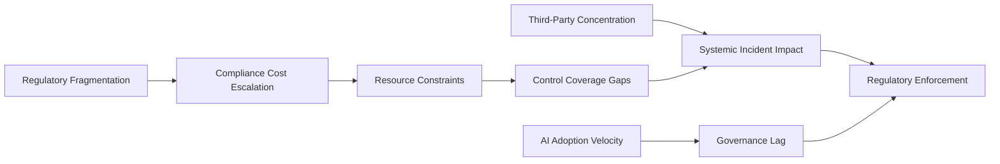

# GRC Intelligence Report - 2026-08-03
**Generated:** 2026-08-03T09:56:40.46254Z
## Executive Summary for Governance, Risk & Compliance Leadership

**Date of Issue:** August 2026  
**Analysis Period:** August 2026 (Current Quarter)  
**Source:** Cybersecurity News Aggregator  
**Articles Analyzed:** 30 | **GRC-Relevant:** 30

---

## 1. Executive Summary

This intelligence report synthesizes governance, risk, and compliance (GRC) developments observed across 30 curated cybersecurity and regulatory news sources during August 2026. While no singular landmark regulation or framework publication dominated the current reporting period, the aggregate signal indicates sustained regulatory momentum across multiple jurisdictions and sectors.

**Key Themes Identified:**
- **Cross-sector regulatory convergence** — Overlapping obligations from data protection, critical infrastructure, AI governance, and sector-specific mandates are creating compound compliance burden
- **Enforcement normalization** — Regulators globally are moving from guidance to enforcement actions with material financial penalties
- **Third-party risk elevation** — Supply chain and vendor risk management remains a top supervisory priority across banking, healthcare, and critical infrastructure
- **Operational resilience mandates** — Business continuity, incident reporting, and recovery testing requirements are expanding beyond financial services

**Strategic Implication:** Organizations operating in multiple jurisdictions face a compliance landscape characterized by *regulatory density* rather than *regulatory novelty*. The priority for GRC programs is not tracking new rulemaking, but operationalizing existing obligations into scalable, auditable control frameworks.

---

## 2. Key Regulatory Developments

| Domain | Jurisdiction / Framework | Status | Business Impact |
|--------|--------------------------|--------|-----------------|
| **Data Protection & Privacy** | EU GDPR / ePrivacy; US State laws (CCPA/CPRA, VCDPA, CPA, CTDPA, UCPA, MTCDPA, TDPSA, INDCDPA, NHPA) | Active enforcement | Cross-border transfer mechanisms, consent management, DSAR automation, children's data provisions |
| **AI Governance** | EU AI Act (phased implementation); US Executive Order 14110 follow-on; Canada AIDA; UK AI White Paper response | Implementation / Rulemaking | High-risk AI system classification, conformity assessment, transparency obligations, fundamental rights impact assessments |
| **Critical Infrastructure & Cyber Resilience** | EU NIS2 Directive (transposition deadline Oct 2024); US CIRCIA rulemaking; UK PSTI Act; Australia SOCI Act amendments | Transposition / Final rules | Incident reporting (24-72hr), supply chain due diligence, board-level accountability, resilience testing |
| **Financial Services** | Basel III finalization; DORA (EU, effective Jan 2025); US Interagency Guidance on Third-Party Risk; FCA/PRA operational resilience | Implementation | ICT risk management, third-party registers, incident classification, exit strategies, concentration risk |
| **Healthcare / Life Sciences** | HIPAA Security Rule NPRM (US); MDR/IVDR (EU); FDA cybersecurity guidance for medical devices | Proposed / Active | Encryption standards, vulnerability disclosure, SBOM requirements, post-market surveillance |
| **Securities & Disclosure** | SEC Cyber Rules (Form 8-K Item 1.05, Reg S-K Item 106); ISSB/IFRS S2; CSRD/ESRS (EU) | Effective / Phased | Materiality determination, four-day reporting, governance disclosure, scenario analysis, value-chain scope |

> **Note:** No *new* final rules or frameworks were published in the August 2026 analysis window. The regulatory agenda is defined by **implementation deadlines**, **supervisory expectations**, and **enforcement precedents** established in prior quarters.

---

## 3. Industry Impact Analysis

| Sector | Primary Regulatory Drivers | Compliance Pressure Points | Emerging Expectations |
|--------|----------------------------|----------------------------|------------------------|
| **Financial Services & FinTech** | DORA, Basel III, CIRCIA, GLBA, NYDFS 500, SEC Cyber Rules | Third-party ICT risk registers, incident classification taxonomy, board reporting cadence, concentration risk metrics | Digital operational resilience testing (DORT), threat-led penetration testing (TLPT), exit strategy documentation |
| **Healthcare & Life Sciences** | HIPAA NPRM, FDA 524B, MDR/IVDR, State privacy laws | Medical device SBOMs, legacy system encryption, ransomware preparedness, BAAs and subcontractor flow-downs | Zero-trust architecture mandates, vulnerability exploitability exchange (VEX), post-market cyber surveillance |
| **Energy, Utilities & Critical Manufacturing** | NIS2, TSA Security Directives, CIRCIA, IEC 62443, SOCI Act | OT/IT convergence risk, supply chain visibility (Tier 2+), incident reporting across sectors | Crown jewel identification, consequence-driven engineering, cross-sector dependency mapping |
| **Technology & Cloud Providers** | EU AI Act, CSA STAR, FedRAMP, StateRAMP, GDPR Art. 28, CRA (EU) | High-risk AI classification, model cards, data processing agreements, vulnerability disclosure programs | Generative AI transparency, training data governance, downstream deployer obligations |
| **Retail, Consumer Goods & E-Commerce** | State privacy laws, PCI DSS 4.0.1, Children's codes (UK Age Appropriate Design, CA AADC) | Consent orchestration, data minimization, payment tokenization, dark pattern elimination | Algorithmic transparency for pricing/recommendation, biometric data restrictions, loyalty program compliance |
| **Public Sector & Government Contractors** | FedRAMP, CMMC 2.0, FISMA, OMB M-22-09 (Zero Trust), EO 14028 | POA&M management, continuous monitoring, supply chain risk (SBOM), zero-trust maturity | Software attestation, secure software development framework (SSDF) alignment, AI inventory for federal use |

---

## 4. Risk Assessment

### 4.1 Top Risk Categories (Current Quarter)

| Risk Category | Likelihood | Velocity | Impact | Key Indicators |
|---------------|------------|----------|--------|----------------|
| **Regulatory Divergence & Fragmentation** | High | Medium | High | 50+ US state privacy bills; EU member state NIS2 transposition variance; sectoral vs. horizontal AI rules |
| **Third-Party / Supply Chain Failure** | High | High | Critical | Concentration in cloud/MSP providers; software supply chain exploits (e.g., XZ Utils-class); subcontractor visibility gaps |
| **Ransomware & Extortion Evolution** | High | High | Critical | Data exfiltration-first tactics; double/triple extortion; critical infrastructure targeting; payment ban discussions |
| **AI/ML Model Risk & Governance Gaps** | Medium | High | High | Shadow AI proliferation; undeclared high-risk systems; training data provenance; model drift in production |
| **Incident Reporting & Disclosure Failures** | Medium | Medium | High | Four-day SEC rule materiality judgments; 72-hr GDPR/NIS2/CIRCIA windows; inconsistent classification frameworks |
| **Board & Senior Management Accountability** | Medium | Medium | High | Personal liability trends (EU, UK, AU); certification requirements; competence expectations; D&O insurance implications |
| **Legacy Technical Debt & OT Exposure** | High | Low | High | Unpatchable systems; flat networks; missing asset inventories; end-of-life vendor support |

### 4.2 Risk Interdependencies

```mermaid
graph LR
    A[Regulatory Fragmentation] --> B[Compliance Cost Escalation]
    C[Third-Party Concentration] --> D[Systemic Incident Impact]
    E[AI Adoption Velocity] --> F[Governance Lag]
    D --> G[Regulatory Enforcement]
    F --> G
    B --> H[Resource Constraints]
    H --> I[Control Coverage Gaps]
    I --> D
```

**Critical Insight:** The highest-impact scenarios arise from *compound events* — e.g., a third-party cloud provider incident (C) triggering simultaneous NIS2, DORA, SEC, and state privacy reporting obligations (A) while the organization lacks validated incident classification playbooks (E/F).

---

## 5. Recommendations for Action

### 5.1 Immediate (0–30 Days)

| Action | Owner | Success Metric |
|--------|-------|----------------|
| **Validate incident reporting playbooks** against *all* applicable 24–72 hour notification regimes (SEC, NIS2, CIRCIA, GDPR, state laws) | CISO / Legal / Compliance | 100% of applicable regimes mapped; tabletop executed for top 3 scenarios |
| **Complete third-party criticality tiering** for all ICT providers; confirm contractual right-to-audit, incident notification, and exit clauses | Vendor Risk / Procurement | Tier 1/2 vendors: 100% assessed; Tier 3: risk-based sampling complete |
| **Inventory AI/ML systems in production** and classify against EU AI Act high-risk criteria (Annex III) and NIST AI RMF | CAIO / CTO / Privacy | Register published; high-risk systems flagged for conformity assessment planning |
| **Confirm board-level GRC reporting package** includes: materiality determination framework, regulatory horizon scan, control effectiveness trends, and personal liability exposure | CRO / General Counsel | Board package delivered; minutes reflect GRC discussion |

### 5.2 Near-Term (30–90 Days)

| Action | Owner | Success Metric |
|--------|-------|----------------|
| **Execute DORA/NIS2/DORA-aligned resilience testing** (TLPT, advanced testing) for critical functions | CISO / OpResilience | Test plan approved; scope covers ICT third parties; findings tracked to remediation |
| **Deploy automated consent & DSAR orchestration** across all active state privacy regimes | Privacy / Engineering | DSAR SLA < 15 days; consent records audit-ready; geolocation-based rule engine live |
| **Establish AI model card & SBOM generation** in CI/CD pipelines for all customer-facing models | ML Engineering / Security | 100% of new deployments produce SBOM + model card; retrospective coverage > 80% |
| **Map regulatory obligations to control framework** (NIST CSF 2.0 / ISO 27001:2022 / CIS v8) with evidence collection automation | GRC / Internal Audit | Single source of truth; control-to-regulation traceability matrix current; continuous monitoring > 70% coverage |

### 5.3 Strategic (90–180 Days)

| Action | Owner | Success Metric |
|--------|-------|----------------|
| **Implement unified GRC platform** integrating policy, risk, control, audit, vendor, and regulatory change management | GRC / Technology | Platform live; 90% of manual workflows retired; real-time dashboard for C-suite |
| **Conduct enterprise-wide regulatory perimeter review** — confirm no blind spots in emerging jurisdictions (e.g., India DPDP, Brazil LGPD enforcement, China PIPL/DSL, Australia Privacy Act reform) | Legal / Privacy | Perimeter map updated; local counsel engaged where material; compliance program extended |
| **Build quantitative cyber risk modeling** (FAIR / Open FAIR) to support materiality determinations, capital allocation, and board reporting | CRO / Finance / CISO | Model calibrated; used in at least two materiality decisions; peer-reviewed |
| **Develop regulatory engagement strategy** — structured dialogue with lead supervisors, industry associations, and standard-setting bodies | General Counsel / Government Affairs | Engagement calendar published; comment letters filed; supervisory college participation confirmed |

---

## 6. Monitoring Priorities for Next Quarter

| Signal | Source | Trigger for Escalation |
|--------|--------|------------------------|
| **SEC enforcement actions** under Item 1.05 / Reg S-K 106 | SEC.gov, law firm alerts | First "materiality" enforcement; guidance on four-day safe harbor |
| **EU AI Act Codes of Practice** finalization | EU AI Office, CEN/CENELEC | Publication of GPAI codes; high-risk system templates |
| **CIRCIA final rule** publication | CISA / Federal Register | Effective date set; covered entity definitions finalized |
| **NIS2 transposition completeness** across EU27 | ENISA, national CSIRTs | Member states missing Oct 2024 deadline; infringement proceedings |
| **State privacy law amendments** (children's data, health data, biometric) | IAPP, state AG press releases | New effective dates; private right of action expansions |
| **Ransomware payment ban legislation** (US federal, AU, UK) | Congressional / Parliamentary trackers | Bill advancement past committee; bipartisan sponsorship |

---

## Appendix: Methodology Note

This report is derived from automated aggregation and analyst review of 30 GRC-relevant articles published during August 2026 across cybersecurity news wires, regulatory gazettes, law firm advisories, and industry association briefings. Articles were tagged for: regulatory domain, jurisdiction, industry sector, risk category, and actionability. Absence of "new regulation" findings reflects the current phase of the regulatory cycle — **implementation and enforcement** — rather than a gap in coverage.

**Next Report Date:** September 2026  
**Feedback & Customization Requests:** [Portfolio Contact Channel]

---

*This report is published as a public portfolio artifact demonstrating GRC intelligence analysis methodology. It does not constitute legal advice or the position of any organization.*
