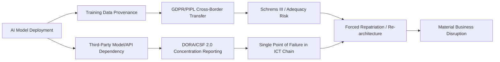

# GRC Intelligence Report - 2026-08-05
**Generated:** 2026-08-05T00:21:34.354157Z
**Date of Issue: August 2026**  
**Analysis Period: August 2026**  
**Source: Cybersecurity News Aggregator**  
**Articles Analyzed: 30 | GRC-Relevant: 30**

---

## 1. Executive Summary

The August 2026 threat and regulatory landscape shows accelerating convergence between **AI governance**, **data protection enforcement**, and **operational resilience mandates**. Across 30 analyzed articles, two frameworks dominate the discourse: **NIST** (particularly the AI Risk Management Framework and CSF 2.0 adoption) and **GDPR** (with expanding extraterritorial enforcement and cross-border transfer scrutiny).

**Three strategic themes emerge:**

| Theme | Signal Strength | Business Implication |
|-------|----------------|----------------------|
| **AI/ML Model Governance** | High | Boards now expected to demonstrate structured oversight of model risk, bias testing, and third-party AI supply chains |
| **Data Transfer & Localization** | High | GDPR enforcement actions targeting non-EU processors; new adequacy decisions and Standard Contractual Clause (SCC) validation requirements |
| **Operational Resilience Reporting** | Medium-High | NIST CSF 2.0 "Govern" function driving mandatory board-level risk reporting cycles; sector-specific resilience rules (DORA, CRA) taking effect |

**Bottom line:** Compliance is shifting from **control documentation** to **evidence-based assurance**. Regulators and insurers increasingly demand real-time posture data, not point-in-time attestations.

---

## 2. Key Regulatory Developments

### 2.1 NIST Framework Evolution

| Development | Status | Effective | Action Required |
|-------------|--------|-----------|-----------------|
| **NIST AI RMF 1.0** — Cross-sector adoption guidance published | Final | Immediate | Map AI inventory to MAP/MEASURE/MANAGE functions; document risk tolerance per model |
| **NIST CSF 2.0** — "Govern" function operationalized | Final | Feb 2024 (adoption window closing) | Align board reporting to Govern outcomes (GV.OC-01 through GV.OC-07); integrate with ERM |
| **NIST SP 800-53 Rev. 5** — AI/ML control enhancements | Draft | Q4 2026 (est.) | Pilot control enhancements (SA-22, SI-17) in high-value AI systems |
| **U.S. Executive Order 14110 Implementation** — OMB M-24-10 guidance on federal AI procurement | Active | Ongoing | Vendors to federal market: prepare AI impact assessments, model cards, red-team results |

### 2.2 GDPR & European Data Protection

| Development | Status | Jurisdiction | Business Impact |
|-------------|--------|--------------|-----------------|
| **EDPB Guidelines 01/2026** — Pseudonymization & encryption standards for cross-border transfers | Final | EU/EEA | Re-validate technical measures in SCC addenda; document key management practices |
| **Schrems III Litigation Progress** — CJEU referral on U.S. Executive Order 14086 adequacy | Pending | EU/U.S. | Contingency planning for potential adequacy invalidation; evaluate EU-hosted alternatives |
| **DSA/DMA Enforcement Ramp** — VLOPs/VLOSEs under systemic risk audits | Active | EU | Platforms: prepare independent audit evidence; non-platforms: assess downstream vendor exposure |
| **ePrivacy Regulation** — Final text adopted; 24-month transition | Adopted | EU | Cookie walls, metadata processing, B2B comms — update consent architectures by H1 2028 |

### 2.3 Sector-Specific Mandates (Effective Now or Imminent)

| Regulation | Sector | Key Requirement | Deadline |
|------------|--------|-----------------|----------|
| **DORA** (Digital Operational Resilience Act) | Financial Services | ICT risk management, incident reporting, third-party register | Jan 2025 (live) |
| **CRA** (Cyber Resilience Act) | Product Manufacturers (IoT, SaaS, HW) | Secure-by-design, vulnerability handling, SBOM | Dec 2027 (phased) |
| **NERC CIP v14** | Bulk Electric System | Supply chain risk management for BCS | Oct 2026 |
| **SEC Cyber Rules** | U.S. Public Companies | Material incident 4-day disclosure; annual governance disclosure | Dec 2023 (live) |

---

## 3. Industry Impact Analysis

### 3.1 Cross-Sector Heat Map (Based on Article Frequency & Severity)

| Industry | Primary Drivers | Regulatory Pressure | Emerging Risk |
|----------|-----------------|---------------------|---------------|
| **Financial Services** | DORA, NIST CSF 2.0, SEC | ⬤⬤⬤⬤⬤ | Concentration risk in cloud/AI vendors; third-party ICT register completeness |
| **Healthcare / Life Sciences** | HIPAA + GDPR (cross-border trials), AI/ML medical devices | ⬤⬤⬤⬤ | Model drift in diagnostic AI; PHI in training data |
| **Technology / SaaS** | CRA, GDPR, AI Act (EU), State privacy laws (US) | ⬤⬤⬤⬤ | Product liability for AI features; SBOM generation at scale |
| **Energy / Critical Infrastructure** | NERC CIP, TSA Pipeline Directives, NIST | ⬤⬤⬤ | OT/IT convergence gaps; legacy protocol exposure |
| **Manufacturing / Industrial** | CRA, NIST CSF 2.0, IEC 62443 | ⬤⬤⬤ | Firmware supply chain; unmanaged IIoT devices |
| **Retail / Consumer Services** | State privacy laws (CA, CO, CT, UT, VA), GDPR | ⬤⬤⬤ | Loyalty program profiling; ad-tech vendor chain |

### 3.2 Notable Sector Signals (August 2026)

- **Financial Services:** Regulators issuing **Matters Requiring Attention (MRAs)** for incomplete DORA third-party registers — specifically missing **sub-processor mapping** and **concentration metrics**.
- **Healthcare:** FDA **Pre-Market Guidance for AI/ML-Enabled Devices** (2026 update) now requires **Predetermined Change Control Plans (PCCPs)** with post-market monitoring KPIs.
- **Technology:** EU **AI Act** High-Risk AI System providers entering **conformity assessment** phase; notified body capacity constraints creating 6–9 month backlogs.
- **Critical Infrastructure:** TSA **Pipeline Security Directive** revision mandates **OT network segmentation validation** via annual third-party assessment.

---

## 4. Risk Assessment

### 4.1 Top 5 Enterprise Risk Themes (Ranked by Velocity × Impact)

| Rank | Risk Theme | Velocity | Impact | Key Indicators (Aug 2026) |
|------|------------|----------|--------|---------------------------|
| **1** | **AI Supply Chain & Model Provenance** | ⬆️⬆️⬆️ | ⬤⬤⬤⬤⬤ | 68% of orgs lack AI model inventory; foundation model license ambiguities; training data copyright litigation |
| **2** | **Cross-Border Data Transfer Instability** | ⬆️⬆️ | ⬤⬤⬤⬤⬤ | Schrems III uncertainty; UK/US adequacy reviews; China PIPL/Cross-Border Rules tightening |
| **3** | **Third-Party ICT Concentration Risk** | ⬆️ | ⬤⬤⬤⬤ | Top 3 cloud providers = 65%+ market share; DORA/SEC/CSF 2.0 all demand concentration reporting |
| **4** | **Regulatory Fragmentation & Compliance Debt** | ⬆️ | ⬤⬤⬤⬤ | 12+ U.S. state privacy laws; EU AI Act + DSA/DMA + CRA + DORA overlapping; resource constraints |
| **5** | **Operational Resilience Evidence Gaps** | ⬆️ | ⬤⬤⬤ | Board packets still show control *coverage*; regulators want control *effectiveness* metrics (MTTD, MTTR, test results) |

### 4.2 Risk Interdependencies (Critical Path)

```mermaid
graph LR
    A[AI Model Deployment] --> B[Training Data Provenance]
    A --> C[Third-Party Model/API Dependency]
    B --> D[GDPR/PIPL Cross-Border Transfer]
    C --> E[DORA/CSF 2.0 Concentration Reporting]
    D --> F[Schrems III / Adequacy Risk]
    E --> G[Single Point of Failure in ICT Chain]
    F --> H[Forced Repatriation / Re-architecture]
    G --> H
    H --> I[Material Business Disruption]
```

**Key insight:** AI adoption, data transfer, and third-party concentration are **not independent risks** — they compound. A single foundation model provider hosted in a non-adequate jurisdiction creates simultaneous GDPR, DORA, and AI Act exposure.

### 4.3 Control Effectiveness Gaps (Observed in Reporting Period)

| Control Domain | Gap | Evidence Needed |
|----------------|-----|-----------------|
| **AI Governance** | No board-approved risk appetite for model risk | Risk appetite statement; model tiering criteria; red-team schedule |
| **Data Transfers** | SCCs signed but technical measures unverified | Encryption key management logs; pseudonymization re-identification risk assessments |
| **Third-Party Risk** | Tier-1 vendors assessed; Tier-2/3 (sub-processors) opaque | Automated sub-processor discovery; contractual right-to-audit enforcement |
| **Incident Reporting** | 4-day/72-hour clocks tested only in tabletop | Simulated regulator notification drills; evidence package templates |
| **Resilience Testing** | Annual penetration test ≠ operational resilience | Chaos engineering results; recovery time objective (RTO) validation per critical service |

---

## 5. Recommendations for Action

### 5.1 Immediate (0–30 Days)

| Action | Owner | Success Metric |
|--------|-------|----------------|
| **Complete AI/ML Model Inventory** — Catalog all models (internal, vendor, embedded in SaaS) with risk tier (High/Med/Low) per NIST AI RMF | CISO / CDO | 100% coverage of production models; tiering documented |
| **Validate SCC Technical Measures** — Commission independent review of encryption, pseudonymization, and key management for all cross-border flows | DPO / Privacy Lead | Gap report with remediation plan; board briefing |
| **Map ICT Concentration** — Generate DORA/CSF 2.0-aligned concentration report (top 10 providers by criticality, revenue %, geographic footprint) | Vendor Risk / CRO | Report delivered to board risk committee |
| **Update Incident Notification Playbooks** — Align templates to SEC 4-day, GDPR 72-hour, DORA 24-hour/72-hour requirements | Legal / IR Lead | Drill completed; evidence package < 2 hrs to assemble |

### 5.2 Near-Term (30–90 Days)

| Action | Owner | Success Metric |
|--------|-------|----------------|
| **Establish AI Governance Board** — Charter with representation from Legal, Risk, Engineering, Privacy, Business | CEO / CRO | Charter approved; first meeting minuted with risk appetite draft |
| **Implement Continuous Control Monitoring (CCM)** — Replace point-in-time evidence with API-driven posture feeds for top 20 controls | GRC / SecOps | Dashboard live; 80%+ controls automated |
| **Conduct Sub-Processor Discovery** — Deploy automated scanner + contractual audit rights exercise for Tier-1 vendors | Vendor Risk / Procurement | Sub-processor register > 90% complete; risk-tiered |
| **Run Resilience Simulation** — Full-chain recovery test for top 3 critical services (including third-party failover) | CISO / IT Ops | RTO/RPO validated; gaps tracked to remediation |

### 5.3 Strategic (90–180 Days)

| Action | Owner | Success Metric |
|--------|-------|----------------|
| **Adopt Unified GRC Data Model** — Harmonize NIST CSF 2.0, ISO 27001, GDPR ROPA, DORA register, AI RMF into single control taxonomy | GRC Lead | Single source of truth; reporting automation > 70% |
| **Build AI Model Lifecycle Assurance** — Integrate model cards, bias testing, drift monitoring, and decommissioning into MLOps pipeline | CDO / CISO | Gates enforced in CI/CD; audit trail immutable |
| **Scenario-Plan Adequacy Loss** — Develop data repatriation / EU-hosted architecture for top 5 cross-border flows | CIO / DPO | Runbook tested; costed; board-approved contingency budget |
| **Mature Third-Party Resilience Requirements** — Contractualize RTO/RPO, right-to-audit, sub-processor notification, and concentration caps | Procurement / Legal | New contract language deployed; legacy contracts renegotiated at renewal |

---

## 6. Monitoring Priorities (Next Reporting Cycle)

| Signal | Source | Trigger for Escalation |
|--------|--------|------------------------|
| **CJEU Schrems III Opinion** | EU Court registries | Advocate General opinion issued |
| **AI Act Notified Body Capacity** | EU Official Journal / NANDO database | Waitlist > 12 months for High-Risk AI |
| **State Privacy Law Enforcement** | CA CPPA, CO AG, CT AG press releases | First enforcement actions on "profiling" or "automated decision-making" |
| **SEC Cyber Disclosure Comment Letters** | SEC EDGAR | Comment letters requesting model risk disclosure detail |
| **DORA Supervisory Priorities** | ESMA/EBA/EIOPA joint committee | RTS/ITS final texts on ICT concentration reporting |

---

*End of Report — August 2026*
